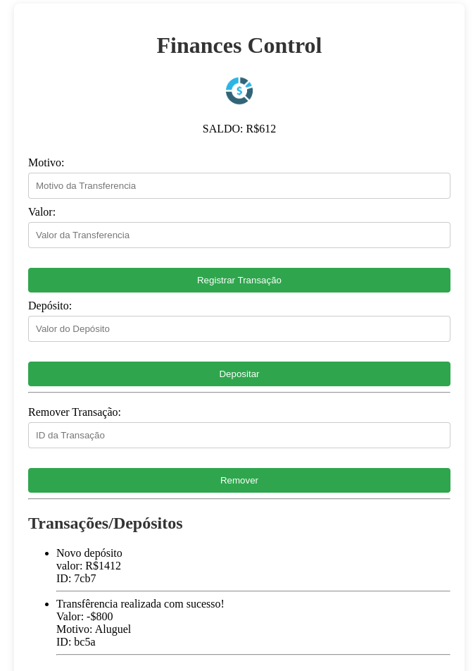

## Controle de Finanças 💰
- Projeto baseado no final do módulo de JavaScript da OneBitCode 🤟
- Projeto desenvolvido utilizando JavaScript, Json-Server (API BackEnd), HTML e CSS.

**FUNCIONALIDADES**
- Realizar depósitos! 💵
- Realizar transferências! 💸
- Excluir trasnferências! 📤
- *Todas as 3 funcionalidades estão presentes no Back-End, através da API Json-Server*

**INTERFACE**

